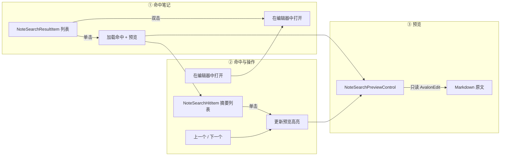
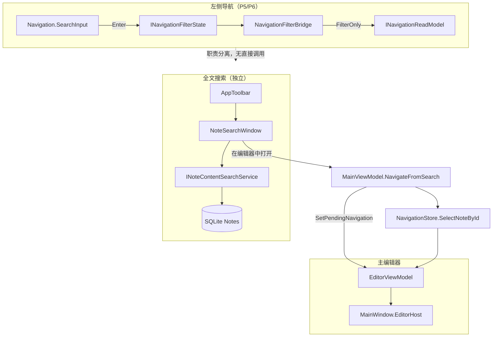
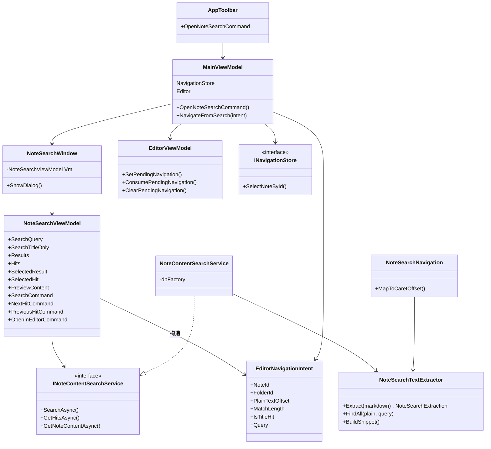
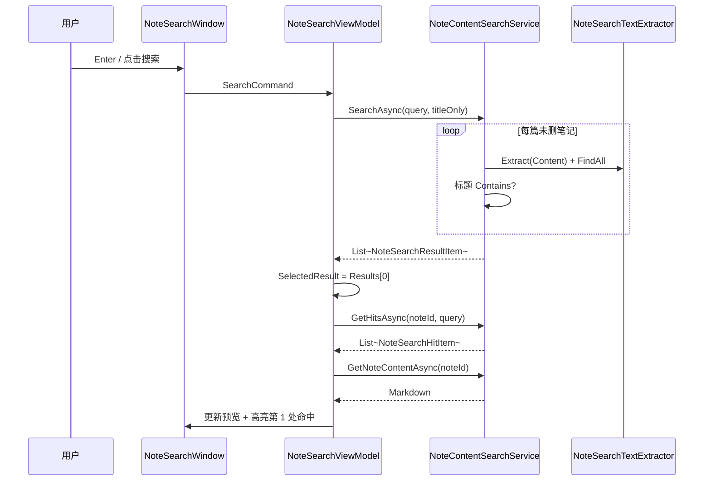
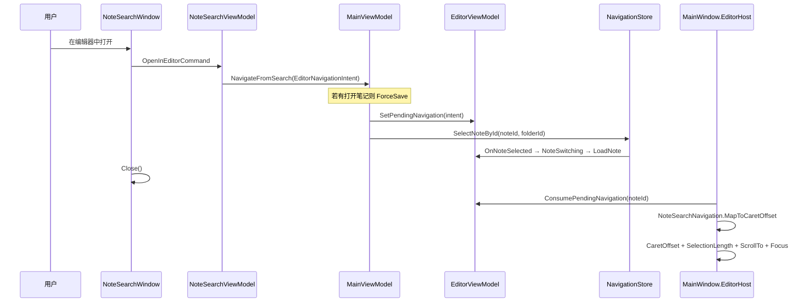
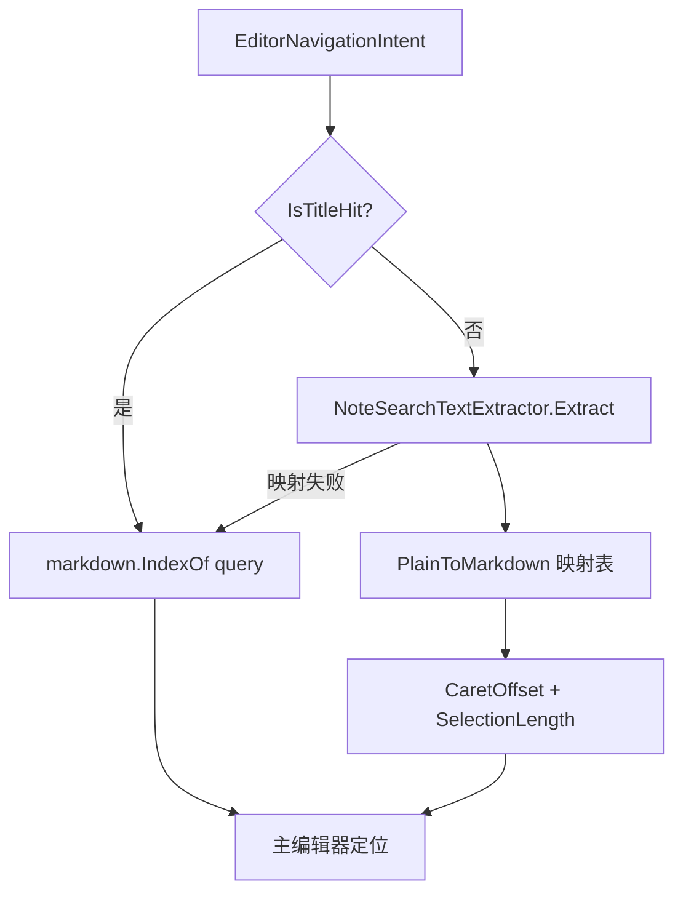
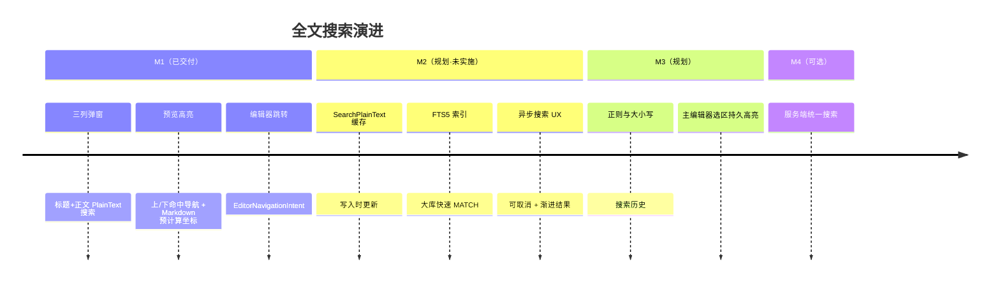
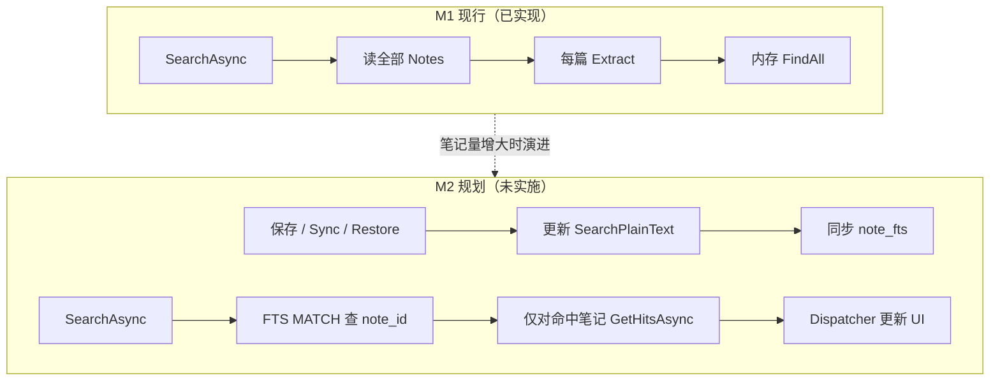

# 全文搜索设计文档

> 描述 BiSheng Latte **工具栏全文搜索弹窗**（标题 + 正文、三列浏览、主编辑器跳转）的产品定位、界面、架构与实现。  
> 与左侧导航栏「标题/文件夹快速筛选」**职责分离**，不经过 `INavigationFilterState` / `FilterOnly` 投影。  
> 导航栏相关背景见 [导航栏架构设计文档](./导航栏架构设计文档.md) · [P5 单向数据流](./P5单向数据流与过滤投影设计文档.md)。

---

## 一、背景与定位

### 1.1 两种搜索，两种场景

| 维度 | 左侧导航搜索 | 工具栏全文搜索（本文） |
|------|--------------|------------------------|
| 频率 | 高 | 低 |
| 范围 | 文件夹名 + 笔记标题 | 标题 + 正文（Markdown → PlainText） |
| 交互 | 过滤树/列表，Enter 生效 | 独立弹窗，三列浏览 + 文内命中导航 |
| 架构路径 | `INavigationFilterState` → `FilterOnly` | `INoteContentSearchService` 独立闭环 |
| 对导航性能 | 搜索激活时 fallback 全量 Refresh | **不影响**导航 Refresh 策略 |

```
用户心智
────────────────────────────────────────────────────────
「我想缩小左侧列表」     →  导航搜索框
「我想在笔记正文里找一段话」 →  工具栏全文搜索 (Ctrl+Shift+F)
```

### 1.2 设计原则

1. **低频重功能独立成窗**：正文扫描、多命中跳转不适合塞进导航 Filter 链路。  
2. **预览只读**：弹窗内不编辑，避免与主编辑器会话冲突。  
3. **跳转一次性意图**：`EditorNavigationIntent` 在 `SelectNoteById` 前设置，主窗口消费后丢弃。  
4. **M1 先正确再快**：内存扫描 + 按需 PlainText 提取；大库优化留到 M2（缓存列 / FTS5）。

---

## 二、M1 功能范围

### 2.1 已实现（M1）

| 能力 | 说明 |
|------|------|
| 入口 | 工具栏按钮 + `Ctrl+Shift+F`；可预填导航区 `SearchInput` 草稿 |
| 搜索 | Enter /「搜索」按钮；可选「仅标题」 |
| 三列 UI | 命中笔记 · 命中摘要与操作 · 只读预览 |
| 命中导航 | 列表选命中、上/下（F3 / Shift+F3）、计数 |
| 在编辑器中打开 | 关窗 → 选中笔记 → 主编辑器 Caret 定位到命中处 |
| 双击笔记 | 等同「在编辑器中打开」（当前选中命中） |

### 2.2 后续阶段（未实现）

| 阶段 | 内容 | 状态 |
|------|------|------|
| **M2** | PlainText 持久化缓存、SQLite FTS5、完整异步搜索 UX | **规划，暂不实施** |
| M3 | 正则 / 大小写、搜索历史、主编辑器持久高亮 | 规划 |
| M4 | 服务端统一搜索（可选） | 规划 |

> M2 详细方案见 [十一、M2 性能优化规划（未实施）](#十一m2-性能优化规划未实施)。**当前代码仍为 M1**，无需数据库迁移。

---

## 三、界面线框

### 3.1 窗口总览

```
┌──────────────────────────────────────────────────────────────────────────────┐
│  全文搜索                                                          [ × ]    │
├──────────────────────────────────────────────────────────────────────────────┤
│  [ 🔍 关键词…                              ]  [ 搜索 ]  ☐ 仅标题             │
│  共 12 篇笔记 · 「项目周报」3 处命中                                          │
├──────────────────┬─────────────────┬───────────────────────────────────────┤
│ ① 命中笔记 28%   │ ② 命中与操作 22% │ ③ 预览 50%                            │
│                  │                 │                                       │
│ ▶ 项目周报       │ 共 3 处         │  # 项目周报                           │
│   工作/项目 · 3  │ ① …进度**词**…  │  本周…**词**…已完成                   │
│   会议纪要 · 1   │ ② …下周**词**…  │  （只读 Markdown + 当前命中选区）      │
│                  │ [◀上一个][下一个▶]│                                       │
│                  │ [在编辑器中打开] │                                       │
└──────────────────┴─────────────────┴───────────────────────────────────────┘
  Min 960×600 · Default 1100×720 · Owner = MainWindow
```

### 3.2 列职责



### 3.3 空态与加载态

| 状态 | 展示 |
|------|------|
| 未搜索 | ① 提示「输入关键词后按 Enter」；②③ 空白 |
| 搜索中 | 顶栏「搜索中…」 |
| 无结果 | 「未找到包含「xxx」的笔记」 |
| 未选笔记 | ②「请从左侧选择一篇笔记」 |
| 仅标题命中 | 预览显示正文；② 仍有标题命中项 |

---

## 四、系统架构

### 4.1 与导航栏的关系



### 4.2 分层与文件

| 层 | 类型 | 路径 |
|----|------|------|
| 服务 | `INoteContentSearchService` | `Services/Search/INoteContentSearchService.cs` |
| 服务 | `NoteContentSearchService` | `Services/Search/NoteContentSearchService.cs` |
| 服务 | `NoteSearchTextExtractor` | `Services/Search/NoteSearchTextExtractor.cs` |
| 服务 | `NoteSearchNavigation` | `Services/Search/NoteSearchNavigation.cs` |
| 模型 | `EditorNavigationIntent` | `Models/EditorNavigationIntent.cs` |
| 模型 | `NoteSearchResultItem` / `NoteSearchHitItem` | `Services/Search/*.cs` |
| VM | `NoteSearchViewModel` | `ViewModels/NoteSearchViewModel.cs` |
| 视图 | `NoteSearchWindow` | `Views/NoteSearchWindow.xaml(.cs)` |
| 控件 | `NoteSearchPreviewControl` | `Controls/Search/NoteSearchPreviewControl.xaml(.cs)` |

---

## 五、类图



---

## 六、核心流程

### 6.1 搜索与预览



### 6.2 在编辑器中打开



**关键顺序**：必须先 `SetPendingNavigation`，再 `SelectNoteById`；消费意图**优先于** `GetSavedPosition`（上次阅读位置）。

### 6.3 PlainText → 主编辑器坐标



---

## 七、搜索算法（M1）

### 7.1 Markdown → PlainText

`NoteSearchTextExtractor` 扫描 Markdown 原文，跳过：

- 围栏代码块 ` ``` … ``` `
- 行首标题 `#`、列表 `-` / `1.`
- 加粗/斜体标记 `*` `_` `~`
- 链接/图片语法，**保留** `[可见文案]`

输出：

- `PlainText`：可搜索字符串（空白折叠）
- `PlainToMarkdown[]`：`plainText[i]` 在原文中的下标

### 7.2 命中计数规则

| 位置 | 计数 |
|------|------|
| 标题 | 每篇最多 +1（`Contains`，忽略大小写） |
| 正文 | PlainText 中 `FindAll` 命中次数 |
| 软删笔记 | 不参与搜索 |

`NoteSearchHitItem.IsTitleHit`：标题命中与正文 PlainText 坐标系不同；预览不强行高亮正文，打开编辑器时用 `IndexOf(query)` fallback。

### 7.3 M1 性能（现行）

- `Task.Run` 后台扫描，减轻 UI 线程阻塞
- 每次搜索对**全部未删笔记**执行 `Extract` + `FindAll`
- 笔记量 **< ~2000 篇**、单次搜索 **< ~200ms** 时可接受
- 超出上述体验阈值时再启动 [M2 规划](#十一m2-性能优化规划未实施)（**当前不做**）

---

## 八、集成点

### 8.1 工具栏与快捷键

| 位置 | 行为 |
|------|------|
| `AppToolbar.xaml` | `OpenNoteSearchCommand`，图标 `&#xE721;`，水平/垂直各一处 |
| `MainWindow.xaml` | `Ctrl+Shift+F` → `OpenNoteSearchCommand` |

### 8.2 MainViewModel

```csharp
// MainViewModel.Shell.cs
[RelayCommand]
private void OpenNoteSearch()
{
    new NoteSearchWindow(_noteContentSearch, NavigateFromSearch, Navigation.SearchInput)
    { Owner = MainWindow }.ShowDialog();
}

internal void NavigateFromSearch(EditorNavigationIntent intent)
{
    Editor.ForceSave(...);
    Editor.SetPendingNavigation(intent);
    if (!NavigationStore.SelectNoteById(intent.NoteId, intent.FolderId))
        Editor.ClearPendingNavigation();
}
```

### 8.3 EditorViewModel 一次性意图

```csharp
Editor.SetPendingNavigation(intent);      // SelectNoteById 之前
var nav = Editor.ConsumePendingNavigation(note.Id);  // NoteSwitching 之后
```

### 8.4 DI

```csharp
services.AddSingleton<INoteContentSearchService, NoteContentSearchService>();
```

`NoteSearchViewModel` 由窗口每次 `new`，不注册单例。

---

## 九、测试

| 测试类 | 覆盖 |
|--------|------|
| `NoteSearchTextExtractorTests` | 标题剥离、链接文案、FindAll 大小写 |
| `NoteContentSearchServiceTests` | 正文命中、仅标题模式、文件夹路径 |
| `NoteSearchNavigationTests` | 多处命中 Markdown 坐标映射 |
| `NavigationViewModelSearchTests` | 导航区 Enter 提交（与全文搜索独立） |

运行建议（完整 `dotnet test` 在部分环境可能因 WPF testhost 退出慢被误判超时）：

```powershell
dotnet test tests\BiSheng.Latte.Tests\BiSheng.Latte.Tests.csproj -c Release
```

当前套件 **40** 项用例（含 `NoteSearchNavigationTests`）。

---

## 十、演进路线



---

## 十一、M2 性能优化规划（未实施）

> **状态：仅设计文档，代码未实现。**  
> M1 已满足当前产品需求；本节供笔记量增大或搜索变慢时再开发。  
> **实施前需单独评审**：数据库迁移、索引维护挂点、全库回填耗时。

### 11.1 为什么要做 M2

M1 每次搜索的路径：

```
读全部 Notes → 每篇 Extract(Markdown) → PlainText FindAll / 标题 Contains
```

瓶颈在于：

| 问题 | 说明 |
|------|------|
| **重复 Extract** | 同一篇笔记每次搜索都重新解析 Markdown |
| **全表扫描** | 无法用索引快速缩小候选笔记集合 |
| **大库 UX** | 即使用 `Task.Run`，用户仍可能长时间看到「搜索中…」 |

M2 目标：**写入时算一次，搜索时走索引**；UI 契约（三列弹窗、`INoteContentSearchService`）保持不变，只替换服务层实现。

### 11.2 三项优化分别是什么

#### A. PlainText 持久化缓存

**含义**：把 `NoteSearchTextExtractor.Extract` 的结果存进 SQLite，搜索时直接读列，不再现场解析 Markdown。

**建议字段**（`LocalNote` 扩展或独立 `NoteSearchIndex` 表）：

| 字段 | 说明 |
|------|------|
| `SearchPlainText` | 去 Markdown 语法后的可搜文本 |
| `SearchIndexedAt` | 索引更新时间，与 `Content` / `UpdatedAt` 对照 |
| `ContentHash`（可选） | 内容变更检测，避免无效重建 |

**维护时机**（须统一入口，避免漏更新）：

- 编辑器 `ForceSave` / 自动保存落盘
- `SyncService` Pull 合并笔记
- 回收站 `Restore`

**与 M1 关系**：M1 的 `NoteSearchTextExtractor` **保留**，改为「写入缓存时调用一次」；`GetHitsAsync` 仍可在缓存 PlainText 上 `FindAll` 算多处命中与 snippet。

#### B. SQLite FTS5 全文索引

**含义**：FTS5（Full-Text Search 5）是 SQLite 内置的全文检索虚拟表，用 `MATCH` 在索引里找词，而不是 `LIKE '%词%'` 扫全表。

**示意**：

```sql
CREATE VIRTUAL TABLE note_fts USING fts5(
  note_id UNINDEXED,
  title,
  content,
  tokenize = 'unicode61'
);
```

| 概念 | 说明 |
|------|------|
| `note_id UNINDEXED` | 只用于关联回 `Notes`，不参与分词 |
| `title` / `content` | 参与检索；`content` 写入 **SearchPlainText** |
| `MATCH '关键词'` | FTS 查询语法，走索引 |

**相对 PlainText 列 + LIKE 的优势**：

- 笔记量大时查询更快
- 支持 BM25 等相关度排序（可选）
- 可先 `LIMIT` 再算详细 Hits，缩短首屏时间

**中文说明**：默认 `unicode61` 对中文不如专业分词引擎精细，但本地笔记场景通常够用；若仍不满意，列为 M3+ 可选（自定义 tokenizer / 外部分词）。

**索引维护**：笔记增删改时同步 `INSERT` / `UPDATE` / `DELETE` FTS 行；与 PlainText 缓存在同一维护管道中完成。

#### C. 完整异步搜索 UX

**含义**：M1 已有 `SearchAsync` + `Task.Run` + `CancellationToken`，M2 在此基础上强化交互，而非仅「把同步代码丢进线程池」。

| 能力 | M1 | M2 目标 |
|------|-----|---------|
| 后台执行 | 有 | 保留 |
| 取消（改词/关窗） | 有 `_searchCts` | 保留并覆盖所有阶段 |
| 首屏结果 | 全部算完才显示 | 可选：FTS 先返回前 N 篇，Hits 懒加载 |
| 状态反馈 | 「搜索中…」 | 可显示进度或「已找到 x 篇」 |
| UI 线程 | 结果一次性回写 | `Dispatcher` 批量更新，避免卡顿 |

**要点**：异步解决 **UI 不卡**；PlainText 缓存 + FTS 解决 **算得快**。三者配套实施 M2 才有明显收益。

### 11.3 M2 目标架构（与 M1 对比）



**不变部分**：

- `INoteContentSearchService` 接口签名
- `NoteSearchWindow` 三列 UI
- `EditorNavigationIntent` 跳转链路
- `NoteSearchHitItem.MarkdownCaretOffset` 等 M1 已交付的命中导航逻辑

**可变部分**：

- `NoteContentSearchService` 内部：FTS 查候选 + 缓存 PlainText 算 Hits
- 数据库：迁移脚本 + 首次全库回填任务（可后台跑、可中断续传）

### 11.4 实施步骤建议（将来开发时）

| 步骤 | 内容 |
|------|------|
| 1 | EF 迁移：`SearchPlainText`（+ 可选 hash / indexedAt） |
| 2 | `INoteSearchIndexMaintainer`：在 Editor 保存、Sync 合并、Trash Restore 调用 |
| 3 | 启动时或设置项：检测 `Content` 变更，批量回填缺失缓存 |
| 4 | 创建 `note_fts`，维护管道双写 PlainText + FTS |
| 5 | `SearchAsync` 改为 FTS 查 `note_id` 列表，再聚合 `HitCount` |
| 6 | `NoteSearchViewModel`：加强 loading / 取消 / 可选渐进展示 |
| 7 | 单测：索引维护、FTS 查询、回填、与 M1 结果一致性抽样对比 |

### 11.5 何时启动 M2（触发条件）

满足 **任一** 可考虑排期（仍非必须）：

- 本地笔记 **> ~2000 篇**，或典型库全文搜索 **> ~200ms**
- 用户反馈弹窗「搜索中…」等待明显
- 计划支持更重的搜索能力（相关度排序、前缀搜等），FTS 更合适

**当前决策：不实施 M2**，继续 M1 即可。

### 11.6 M3 与 M2 的边界（避免混淆）

| 阶段 | 主题 | 示例 |
|------|------|------|
| **M2** | **性能与规模** | PlainText 缓存、FTS5、异步 UX |
| **M3** | **搜索能力与体验** | 正则、区分大小写、搜索历史、主编辑器持久高亮 |
| **M4** | **多端** | 服务端统一搜索（可选） |

M3 **不依赖** M2 才能做部分功能（如大小写开关可在 M1 上加），但大库场景仍建议先做 M2。

---

## 十二、相关文档

| 文档 | 关系 |
|------|------|
| [导航栏架构设计文档](./导航栏架构设计文档.md) | 左侧标题筛选；与全文搜索职责分离 |
| [P5 单向数据流与过滤投影设计文档](./P5单向数据流与过滤投影设计文档.md) | `FilterOnly` 不包含正文搜索 |
| [笔记历史版本设计文档](./笔记历史版本设计文档.md) | 同为工具栏弹窗类功能，可参考窗口模式 |
