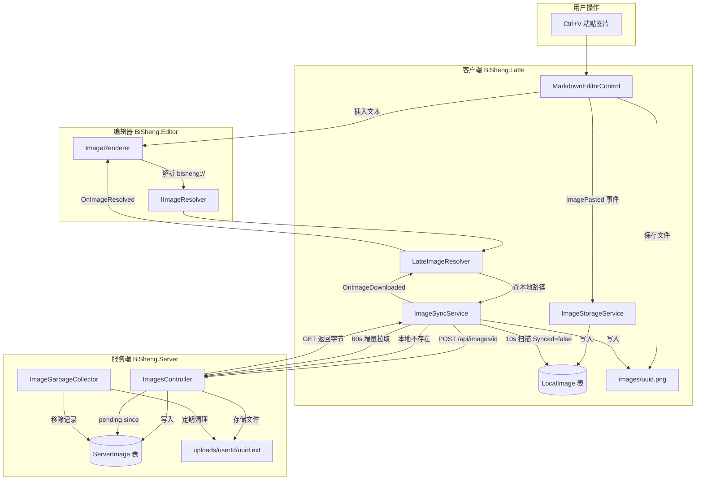

# 图片同步与地址解析设计文档

## 概述

BiSheng 的图片系统独立于笔记文本同步管道，采用 **自定义 URI + 按需解析 + 后台同步** 的架构。图片以 `bisheng://img/{uuid}` 格式嵌入 Markdown 内容，各层通过接口和事件松耦合。

---

## 图片地址格式

图片在笔记 Markdown 内容中以标准 Markdown 图片语法嵌入，URL 部分使用自定义 URI Scheme：

```markdown

```

| 组成部分 | 说明 |
|---------|------|
| `bisheng://` | 自定义 URI Scheme，标识为 BiSheng 托管图片 |
| `img/` | 资源类型路径段 |
| `{uuid}` | 图片全局唯一标识（与服务端 `ServerImage.Id` 一致） |

**为什么使用自定义 URI 而非本地路径或 HTTP URL：**

| 考量 | 说明 |
|------|------|
| 跨设备同步 | 本地路径在不同设备上不同，UUID 全局唯一且设备无关 |
| 异步解析 | 图片可能尚未下载到本地，需要按需触发下载 |
| 状态统一 | 通过 `ImageResolveStatus` 枚举统一表达 Ready / Loading / Unavailable |

---

## 地址解析管道

### 三层架构

```
BiSheng.Editor（渲染层）
├── ImageRenderer          ← 拦截 ，分发到不同处理逻辑
└── IImageResolver         ← 纯接口，不涉及任何宿主实现

BiSheng.Latte（桥接层）
├── LatteImageResolver     ← IImageResolver 实现，桥接编辑器与同步服务
├── ImageStorageService    ← 本地 SQLite 元数据管理（LocalImage 表）
└── ImageSyncService       ← 上传 / 下载 / 增量拉取

BiSheng.Server（服务端）
├── ImagesController       ← 图片上传 / 下载 / 软删除 API
├── ServerImage 表         ← 图片元数据
└── ImageGarbageCollector  ← ImageCleanupService：过期软删除硬删 + 无引用孤儿软删
```

### URI 解析流程

当 AvalonEdit 构建 VisualLine 时，`ImageRenderer`（继承 `VisualLineElementGenerator`）拦截 `` 语法，按 URL 类型分发：

```
 被 ImageRenderer.ConstructElement 拦截
    │
    ├── http:// 或 https://
    │   → LoadNetworkImageAsync（异步下载 → 缓存 → 重绘）
    │
    ├── bisheng://img/{uuid}
    │   → IImageResolver.ResolveLocalPath(uri)
    │       ├── 本地 images/{uuid}.png 存在 → 加载 → 缓存 → 渲染
    │       └── 本地不存在 → 检查状态
    │           ├── Loading → 显示"下载中..."占位符
    │           └── Unavailable → 触发 RequestDownload → 显示"图片未同步"占位符
    │
    ├── 本地文件路径（如 C:\...\image.png）
    │   → LoadLocalImage → 缓存 → 渲染
    │
    └── 其他 / 不存在
        → 显示"图片不存在"占位符
```

### 本地磁盘路径处理

用户可能手动将图片地址编辑为本地磁盘路径（如 `C:\Users\xxx\photo.png` 或 `./images/photo.jpg`）。`ImageRenderer` 通过排除法识别本地路径：只要不是 `http://`、`https://`、`bisheng://` 格式，均视为本地路径。

```csharp
private static bool IsLocalPath(string path)
{
    if (string.IsNullOrWhiteSpace(path)) return false;
    if (path.StartsWith("http://") || path.StartsWith("https://")) return false;
    if (IsBiShengUri(path)) return false;
    return true;  // 其他一切视为本地路径
}
```

**处理策略：**

| 场景 | 行为 |
|------|------|
| 路径存在（`File.Exists = true`） | 直接加载图片并渲染，加入缓存 |
| 路径不存在 | 显示"图片不存在"占位符 |
| 加载失败（文件损坏等） | 显示"无法加载图片"占位符 |

**重要限制：本地路径图片不会进入同步管道。**

- 不会被 `ImageStorageService` 记录到 `LocalImage` 表
- 不会被 `ImageSyncService` 上传到服务端
- 同步到其他设备后，该路径在其他设备上无效，显示"图片不存在"

这是有意的设计取舍：本地路径被视为"临时引用"，只有 `bisheng://img/{uuid}` 格式的图片才会进入完整的同步生命周期。如果用户需要图片跨设备同步，应使用粘贴功能（Ctrl+V）插入图片，而非手动输入本地路径。

### LatteImageResolver 解析逻辑

`LatteImageResolver` 是 `IImageResolver` 的具体实现，桥接编辑器与 `ImageSyncService`：

```csharp
// 解析 bisheng://img/{uuid} → 本地路径
string? ResolveLocalPath(string uri)
{
    var imageId = ExtractImageId(uri);  // 提取 uuid
    return _imageSync.GetLocalImagePath(imageId);  // 查 images/{uuid}.png
}

// 状态判断
ImageResolveStatus GetStatus(string uri)
{
    if (本地文件存在) → Ready
    if (正在下载中)   → Loading
    else             → Unavailable
}

// 触发下载
void RequestDownload(string uri)
{
    _ = _imageSync.DownloadImageAsync(imageId);  // 异步，不阻塞 UI
}
```

### 下载完成通知链

```
ImageSyncService 下载完成
    → 触发 OnImageDownloaded 事件 (imageId, localPath)
        → LatteImageResolver 订阅
            → 构造 bisheng://img/{uuid} URI
            → 触发 OnImageResolved 事件
                → UI 层（MainWindow）订阅
                    → 调用 editor.TextArea.TextView.Redraw()
                        → ImageRenderer 重新构建 VisualLine
                            → 本地文件已存在 → 加载渲染
```

---

## 图片同步管道

图片同步与笔记文本同步**完全独立**，互不干扰。

### 同步方向与触发方式

| 方向 | 触发方式 | 频率 | 说明 |
|------|---------|------|------|
| 客户端 → 服务端（上传） | 定时器扫描 `LocalImage.Synced=false` | 每 10 秒 | 批量逐张上传 |
| 服务端 → 客户端（按需下载） | `LatteImageResolver.RequestDownload` | 实时 | 编辑器渲染时触发 |
| 服务端 → 客户端（增量拉取） | 定时器查询 `/api/images/pending` | 每 60 秒 | 自动补齐缺失图片 |

### 上传流程（客户端 → 服务端）

```
用户 Ctrl+V 粘贴图片
    │
    ▼
MarkdownEditorControl
    ├── 生成 UUID
    ├── 保存到本地 images/{uuid}.png
    └── 插入文本: 
            │
            ▼
MainWindow 接收 ImagePasted 事件
    └── ImageStorageService.RecordImage()
        → 写入 LocalImage 表，Synced=false
            │
            ▼
ImageSyncService 定时器（每 10 秒）
    ├── 扫描 LocalImage 表 WHERE Synced=false AND RetryCount<3
    ├── 逐张读取文件字节
    ├── POST /api/images/{uuid}（multipart/form-data）
    │   → 服务端存储到 uploads/{userId}/{uuid}{ext}
    │   → 写入 ServerImage 表
    └── 成功 → MarkSynced / 失败 → MarkFailed (RetryCount++)
```

### 按需下载流程（服务端 → 客户端）

```
ImageRenderer 渲染 bisheng://img/{uuid}
    │
    ├── LatteImageResolver.ResolveLocalPath → null（本地不存在）
    ├── GetStatus → Unavailable
    ├── RequestDownload(uri)
    │   └── ImageSyncService.DownloadImageAsync(uuid)
    │       ├── 防重复：检查 _downloadingIds HashSet
    │       ├── GET /api/images/{uuid}（返回文件字节）
    │       ├── 写入 images/{uuid}.png
    │       └── 触发 OnImageDownloaded 事件
    │           → LatteImageResolver.OnImageResolved
    │               → UI 层 Redraw()
    └── 当前帧显示"图片未同步"占位符 → 下次重绘显示真实图片
```

### 增量拉取流程（服务端 → 客户端）

```
ImageSyncService 定时器（每 60 秒）
    │
    ├── 读取 LocalSyncState.LastImagePullTime
    ├── GET /api/images/pending?since={lastPullTime}
    │   → 服务端返回此后新增/删除的图片列表
    ├── 过滤：跳过 IsDeleted=true 和本地已存在的
    ├── 逐张 DownloadImageByIdAsync
    └── 更新 LocalSyncState.LastImagePullTime = now
```

### 服务端 API

| 端点 | 方法 | 认证 | 说明 |
|------|------|------|------|
| `/api/images/{id}` | POST | API Key | 上传图片（幂等；魔数校验；已存在则返回成功） |
| `/api/images/{id}` | GET | API Key | 下载图片文件 |
| `/api/images/{id}` | DELETE | API Key | 软删除（标记 IsDeleted，文件保留） |
| `/api/images/pending?since={time}` | GET | API Key | 增量拉取：返回 since 之后新增/删除的图片列表 |

### 服务端存储

- **元数据**：`ServerImage` 表（Id, UserId, FileName, ContentType, FileSize, Extension, IsDeleted, DeletedAt, CreatedAt）
- **文件**：磁盘 `uploads/{UserId}/{Id}.{ext}`
- **删除传播（设计如此）**：
  - 客户端从 Markdown 去掉图片引用后**不会**调用 `DELETE /api/images/{id}`，也不清理本机 `images/` 对应文件
  - `GET /api/images/pending` 返回的 `IsDeleted` 项，客户端当前跳过（不删本地文件）
  - 云端空间与隐私窗口依赖下方 **服务端 GC**，而非同步协议即时删除
- **GC 清理**：
  - **过期软删除**：`ImageGarbageCollector` → `ImageCleanupService` 定期扫描 `IsDeleted=true` 且 `DeletedAt` 超过 `ImageRetentionDays`（默认 30 天）的记录，删除磁盘文件并移除数据库记录
  - **孤儿软删**：扫描全部笔记 Markdown（`bisheng://img/{id}` / `/api/images/{id}`），对「上传超过 `ImageGc:OrphanGraceDays`（默认 7 天）仍无任何引用」的图片执行软删除；可选 `ImageGc:OrphanDryRun=true` 仅记日志不写库
  - 引用扫描实现：`NoteImageReferenceScanner`（管理面板笔记页复用同一逻辑）
  - 上传校验：`ImagesController` 在落盘前用 `ImageContentValidator` 校验文件头魔数，拒绝扩展名与内容不符的伪装文件

---

## 数据流全景图



---

## 关键设计决策

### 为什么图片同步独立于笔记文本同步？

| 考量 | 说明 |
|------|------|
| 粒度不同 | 文本是增量 diff 同步，图片是整文件上传/下载 |
| 频率不同 | 文本频繁变更，图片偶尔新增 |
| 带宽管理 | 图片较大，需独立控制上传节奏，避免阻塞文本同步 |
| 失败隔离 | 图片上传失败不影响笔记文本同步，独立重试 |

### 为什么客户端 LocalImage 有 NoteId 而服务端 ServerImage 没有？

| 层次 | NoteId | 原因 |
|------|--------|------|
| 客户端 `LocalImage` | **有** | 客户端需要按笔记管理本地缓存（如查看某笔记的所有图片） |
| 服务端 `ServerImage` | **没有** | Markdown 内容是唯一真相源，保持图片同步管道独立性，避免双真相源一致性风险 |

详见 [数据库设计文档 — ServerImage 与 Notes 解耦设计](数据库设计文档.md#serverimage-与-notes-解耦设计)。
