# 导航栏架构导读与设计模式说明

> 面向阅读代码的开发者：解释 `Services/Navigation/` 下各类的职责、协作方式，以及**为什么**要这样拆分。  
> 阶段演进与 API 索引见 [导航栏架构设计文档](./导航栏架构设计文档.md)。

---

## 一、用一句话理解

**SQLite 变更之后，不直接调用 `FolderTree.Refresh()`，而是先发布「导航投影该怎么变」；由 `NavigationPresentationCoordinator` 统一在 UI 线程上更新树、列表和编辑器。**

可以把它想成：

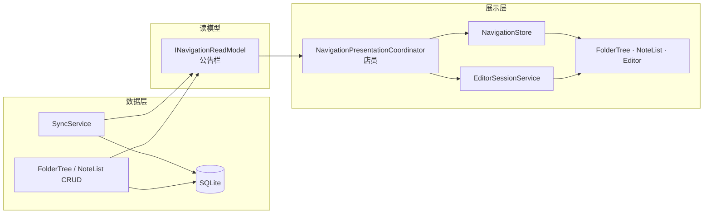

---

## 二、重构前 vs 重构后

### 2.1 以前（问题从哪来）

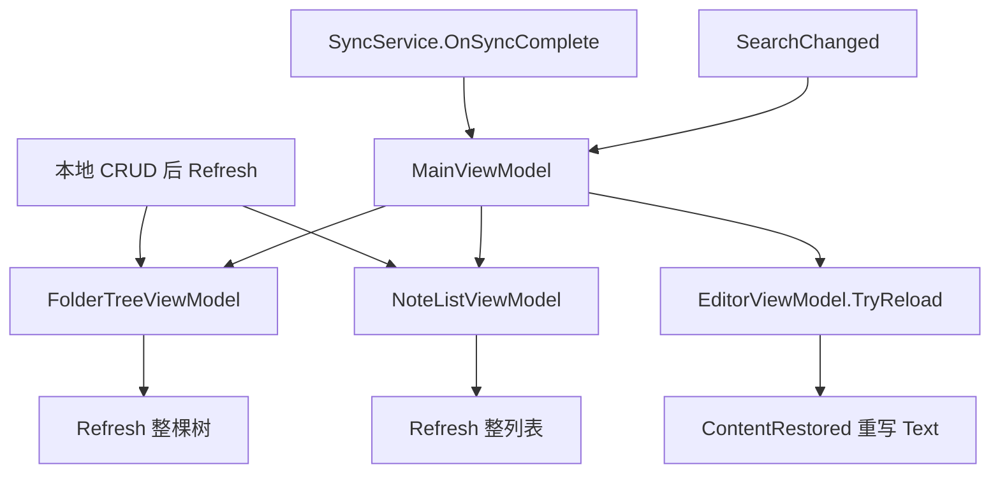

**典型症状：**

| 现象 | 原因 |
|------|------|
| 编辑时光标跳 | 同步后无条件 reload 编辑器 |
| 周期性「刷新感」 | 每条 SignalR 变更全量 Refresh |
| 编辑器被清空 | 多份 `LocalNote` + 同步竞态 |
| 逻辑难改 | Sync / 搜索 / CRUD 各写一套 Refresh |

### 2.2 现在（目标结构）

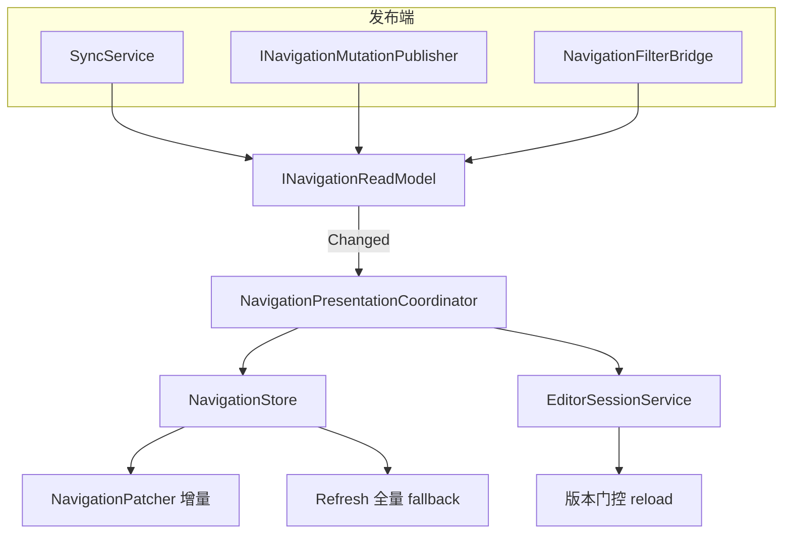

**核心变化：** 所有 UI 更新**只从 ReadModel 进、只经 Coordinator 出**；`MainViewModel` 不再订阅 Sync 完成事件。

---

## 三、三层架构（先记这个，再记类名）

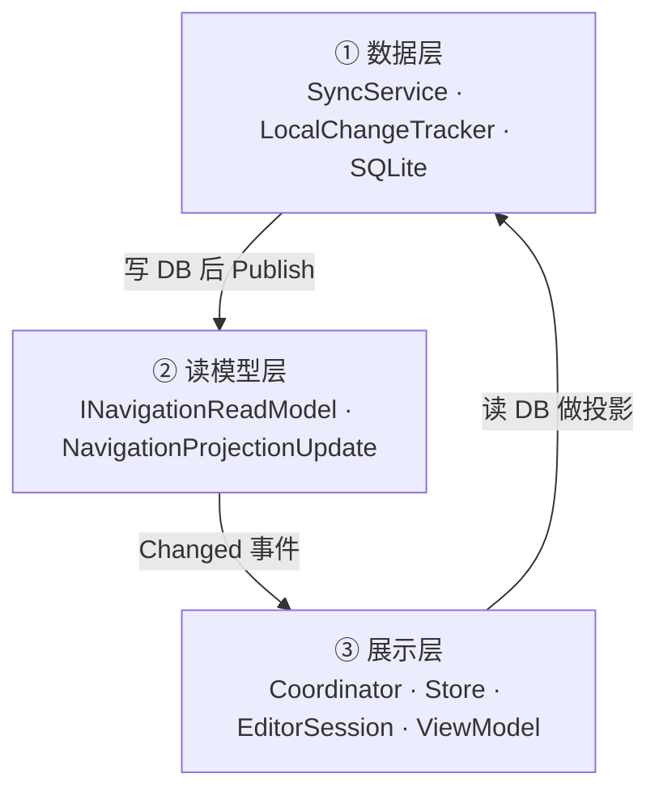

| 层 | 回答的问题 | 不应知道 |
|----|------------|----------|
| 数据层 | 何时 Push/Pull？实体如何持久化？ | TreeView、Dispatcher |
| 读模型层 | 「导航 UI 该收到什么更新指令？」 | 怎么 Insert 树节点 |
| 展示层 | 何时 patch / 何时全量？编辑器 reload 吗？ | HTTP、SignalR 协议 |

---

## 四、各类职责速查

### 4.1 消息格式（变了什么）

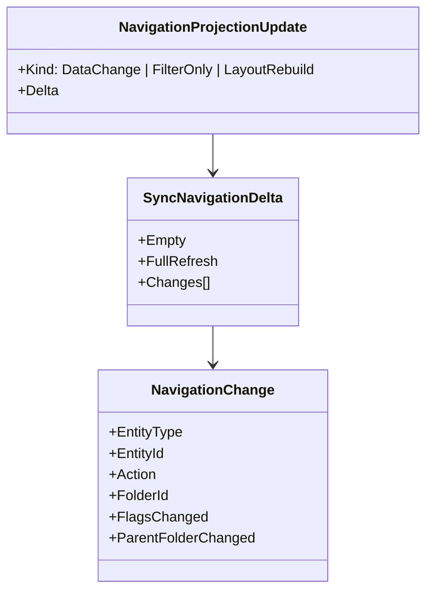

| 类 | 用处 |
|----|------|
| `NavigationChange` | 单条：哪个 Note/Folder、增删改、是否 move/收藏变化 |
| `SyncNavigationDelta` | 一批变更，或 `Empty` / `FullRefresh` |
| `NavigationProjectionUpdate` | 在 Delta 外再包一层：**这类更新该怎么处理 UI** |
| `NavigationDeltaBuilder` | Sync 的 `ChangeDto` → `NavigationChange`（Apply 前检测 parent move） |

**为什么单独定义消息：** UI 不需要懂 Pull/SignalR，只需要「树/列表要动哪些 Id」。

---

### 4.2 发布端（谁往读模型里丢消息）

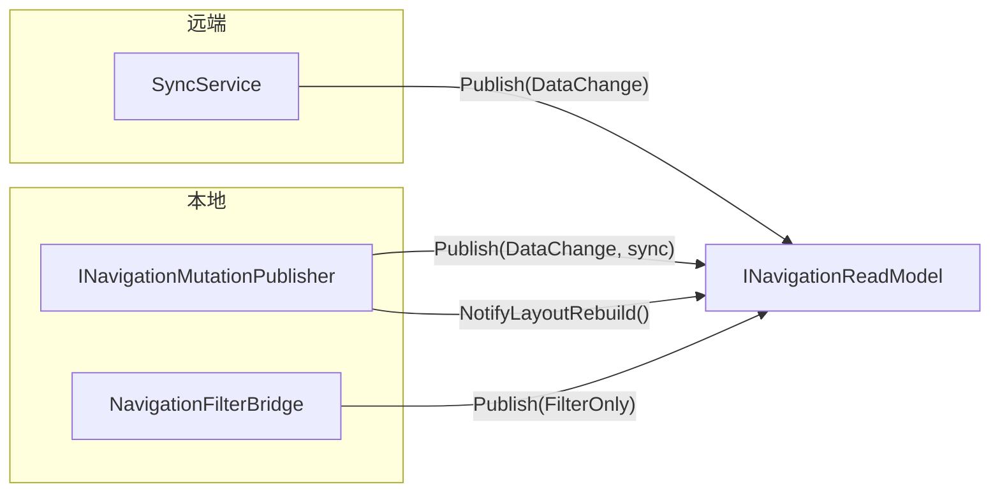

| 类 | 谁调用 | 作用 |
|----|--------|------|
| `INavigationReadModel` | 接口 | `Publish(update)` + `Changed` 事件 |
| `NavigationReadModel` | 实现 | 发事件；本地 CRUD 可同步投递 UI 线程 |
| `INavigationMutationPublisher` | FolderTree / NoteList | 本地 CRUD **唯一出口**（`NotifyNoteCreated` 等） |
| `NavigationMutationPublisher` | 实现 | 拼 `NavigationChange` 再 Publish |
| `NavigationFilterBridge` | DI 构造时挂接 | 搜索框 → `NotifyFilterChanged()` |

**为什么两个接口（ReadModel + MutationPublisher）：**

- **ReadModel** = 所有来源的**汇流点**（远端 + 本地 + 搜索 + 布局），订阅方只有 Coordinator。
- **MutationPublisher** = 给 VM 的**便捷 API**，不必自己拼 Delta。

---

### 4.3 协调与 Store（怎么刷 UI）

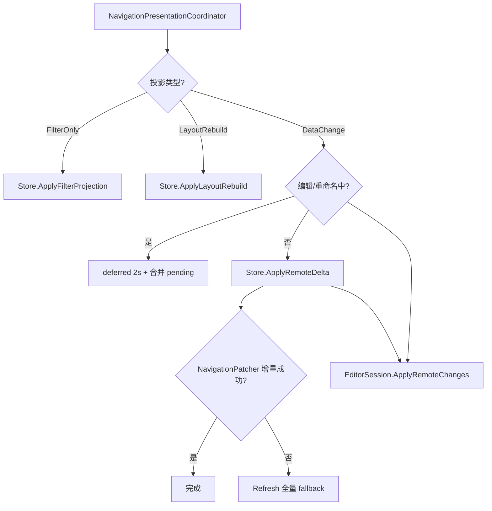

| 类 | 作用 |
|----|------|
| `NavigationPresentationCoordinator` | **唯一**订阅 ReadModel；UI 线程、deferred、按 Kind 分发 |
| `INavigationStore` / `NavigationStore` | 选中解析、`ApplyRemoteDelta` / `ApplyFilterProjection` / `ApplyLayoutRebuild` |
| `NavigationPatcher` | 尝试增量 patch 树/列表 |
| `NavigationRefreshPolicy` | 何时必须 fallback 全量 Refresh |
| `INavigationLayoutMode` | 并列 / 归纳模式，Coordinator 不依赖 MainViewModel |

**为什么 Coordinator 和 Store 分开：**

- **Store**：导航状态 + 怎么改树/列表。
- **Coordinator**：跨 Editor + 树 + 列表的**时机策略**（能否现在刷、要不要 deferred）。

这接近 **Mediator（中介者）**：VM 之间不直接「Sync 完了一起 Refresh」。

---

### 4.4 编辑器会话（为什么单独一条线）

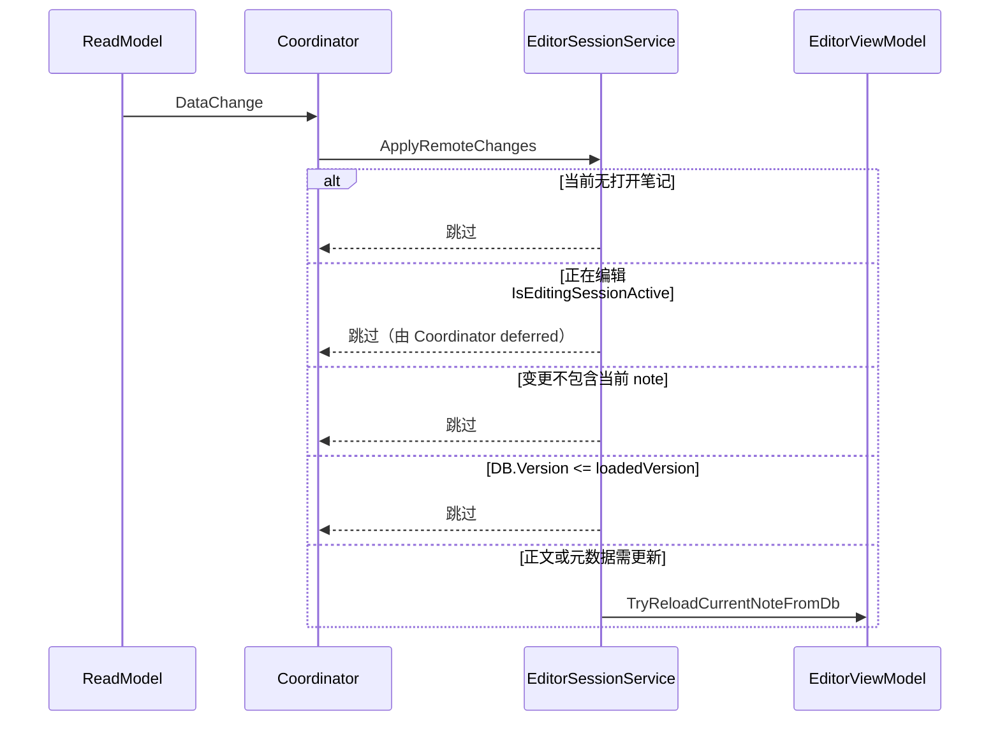

| 类 | 作用 |
|----|------|
| `IEditorSessionService` | 记录 `openNoteId`、`loadedVersion` |
| `EditorViewModel.IsEditingSessionActive` | 焦点 / 近期输入 / 未保存 |

**为什么不在 NavigationPatcher 里 reload 编辑器：**

- 树/列表 = **列表投影**，随时可 patch。
- 编辑器 = **长会话**（光标、滚动、脏内容），只有「版本前进 + 未编辑 + 内容真变」才 reload。

---

### 4.5 合并规则

| 类 | 作用 |
|----|------|
| `LocalNoteMerger` | DB → 内存 `LocalNote` 的唯一合并规则 |
| `LocalFolderMerger` | DB → 树节点 Folder 的合并规则 |

**为什么：** Note 在 DB、NoteList、Editor 各有一份；规则只写一处，避免 Sync 与本地 save 行为不一致（含「DB 空不覆盖非空正文」）。

---

## 五、三种投影类型（P5 关键）

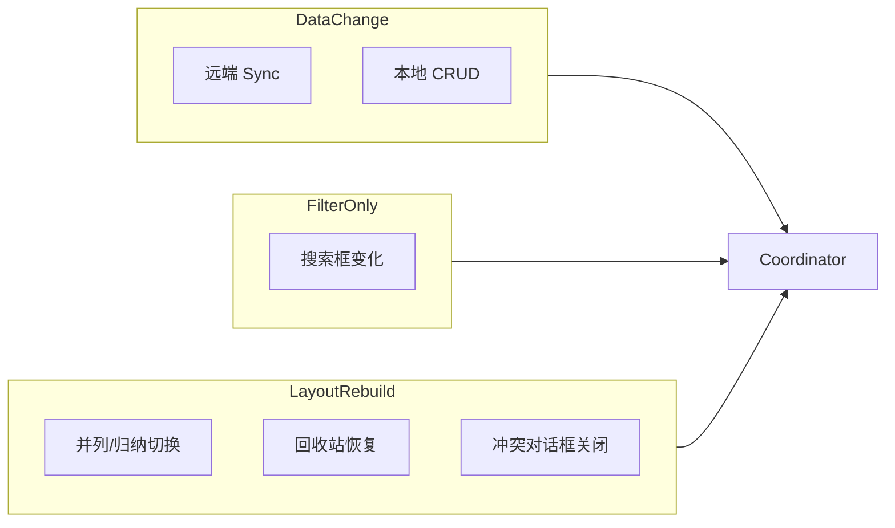

| Kind | 触发 | UI 行为 | 碰编辑器？ |
|------|------|---------|------------|
| `DataChange` | Sync、本地 CRUD | 增量 patch 或 fallback | 是（经 EditorSession，有门控） |
| `FilterOnly` | 搜索 | 只 Refresh 过滤视图 | **否** |
| `LayoutRebuild` | 布局/回收站等 | 全量重建导航 | 一般否 |

**为什么要分三种：** 搜索不是 DB 变更；布局切换需要全量重建，但不应伪装成 Sync 事件去 reload 编辑器。

---

## 六、端到端示例

### 6.1 本地新建笔记

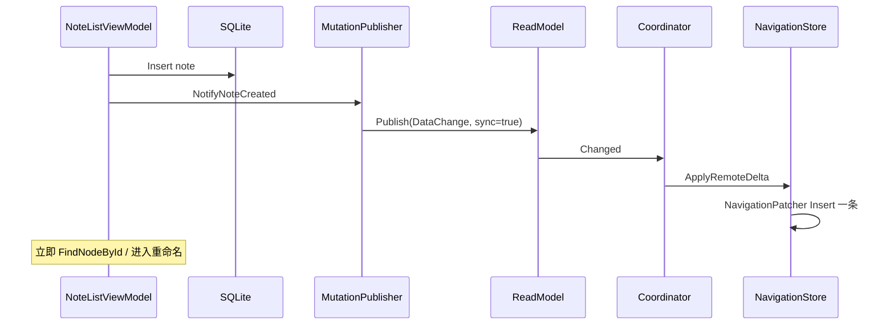

**`waitForPresentation: true` 的原因：** CRUD 代码_publish 后要马上在 UI 里找到新节点做内联重命名，必须同步完成投影。

### 6.2 远端 Pull 三条变更

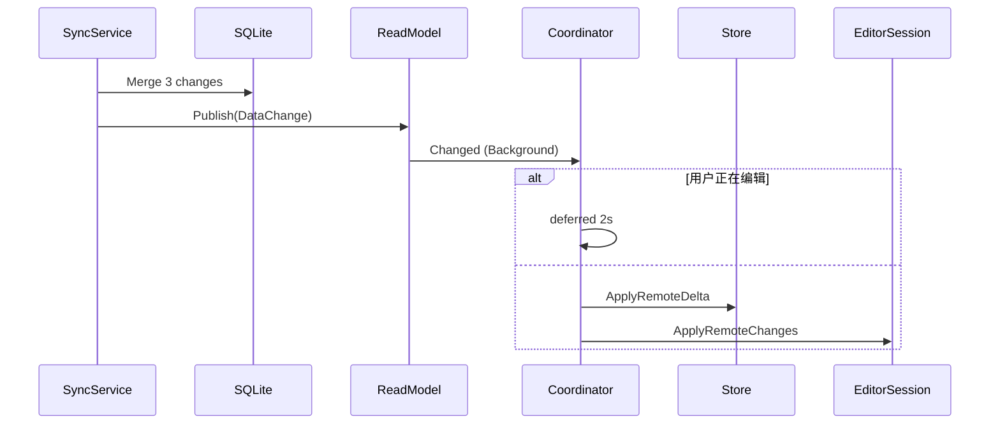

### 6.3 搜索框输入

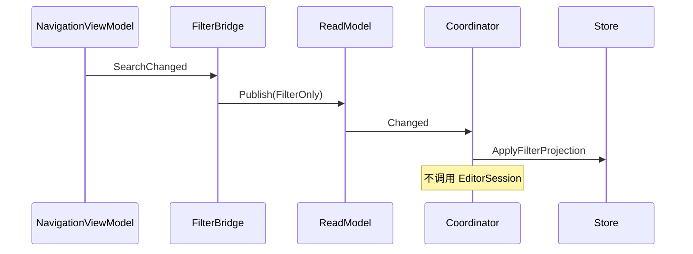

---

## 七、这算哪种设计模式？

不是教科书里的单一模式，而是几种思路的**组合**：

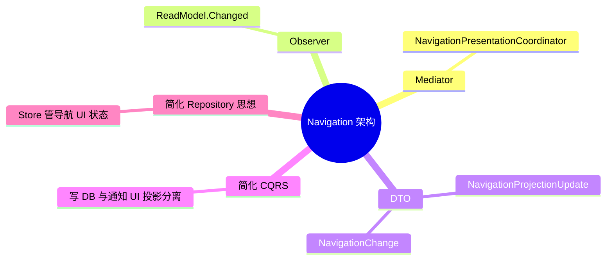

| 名称 | 在本项目中的体现 |
|------|------------------|
| **Mediator** | Coordinator 统一响应 ReadModel，VM 不互相直连 Refresh |
| **Observer** | `ReadModel.Changed` |
| **DTO** | `NavigationChange`、`SyncNavigationDelta` |
| **CQRS（简化）** | 写 SQLite 一条路；通知 UI 投影另一条（无独立 Query 服务） |
| **Session** | `EditorSessionService` 管理打开中的笔记 |

**不是：** 完整 Redux / 严格单向数据绑定 MVVM。WPF 仍用 ViewModel + `ObservableCollection`，只是在 **「何时、以何种方式 Refresh」** 上加了中间层。

---

## 八、Fallback：何时仍全量 Refresh

增量 patch 是**优化路径**，不是唯一路径。

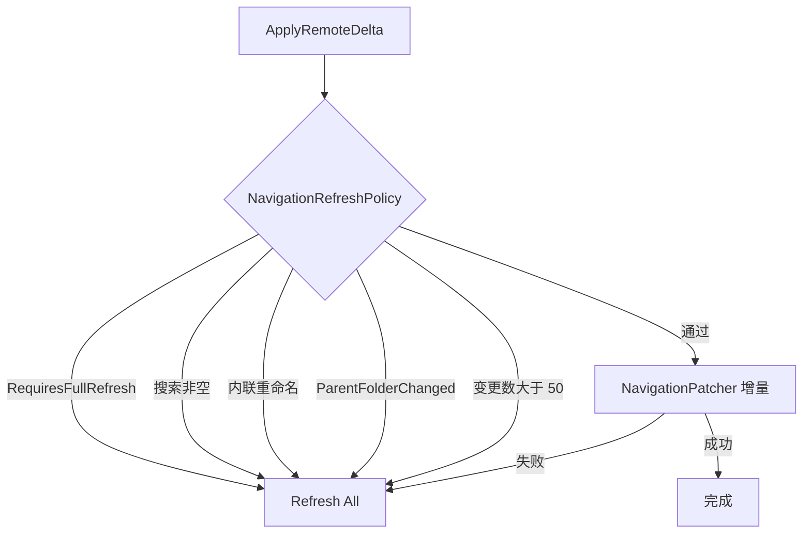

**原则：** 宁可 fallback 全量，不可 patch 错节点导致选中丢失或编辑器被清空。

---

## 九、阅读代码推荐顺序

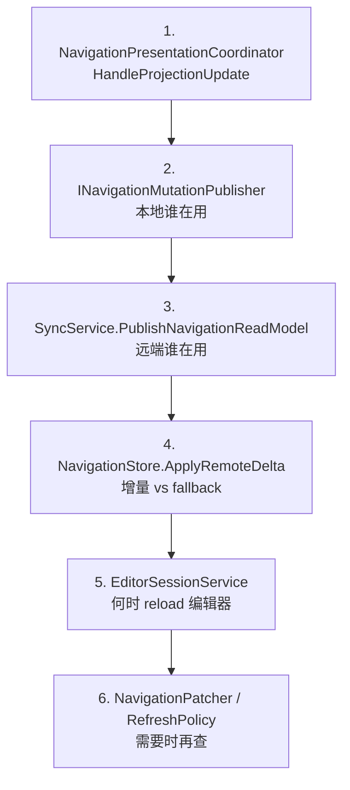

| 顺序 | 文件 | 关注什么 |
|------|------|----------|
| 1 | `NavigationPresentationCoordinator.cs` | 三分投影 + deferred |
| 2 | `INavigationMutationPublisher.cs` | 本地 CRUD API |
| 3 | `SyncService.cs` | `PublishNavigationReadModel` |
| 4 | `NavigationStore.cs` | `ApplyRemoteDelta` / `ApplyFilterProjection` |
| 5 | `EditorSessionService.cs` | 版本门控 |
| 6 | `NavigationPatcher.cs` / `NavigationRefreshPolicy.cs` | 增量细节 |

---

## 十、类与文件对照表

| 类 | 路径 |
|----|------|
| `NavigationChange` / `SyncNavigationDelta` | `Services/Navigation/SyncNavigationDelta.cs` |
| `NavigationProjectionUpdate` | `Services/Navigation/NavigationProjectionUpdate.cs` |
| `INavigationReadModel` | `Services/Navigation/INavigationReadModel.cs` |
| `INavigationMutationPublisher` | `Services/Navigation/INavigationMutationPublisher.cs` |
| `NavigationPresentationCoordinator` | `Services/Navigation/NavigationPresentationCoordinator.cs` |
| `INavigationStore` | `Services/Navigation/INavigationStore.cs` |
| `NavigationPatcher` | `Services/Navigation/NavigationPatcher.cs` |
| `NavigationRefreshPolicy` | `Services/Navigation/NavigationRefreshPolicy.cs` |
| `IEditorSessionService` | `Services/Navigation/EditorSessionService.cs` |
| `LocalNoteMerger` | `Services/Navigation/LocalNoteMerger.cs` |
| `NavigationFilterBridge` | `Services/Navigation/NavigationFilterBridge.cs` |
| DI 注册 | `DependencyInjection/ServiceCollectionExtensions.cs` |

---

## 十一、相关文档

| 文档 | 内容 |
|------|------|
| [导航栏架构设计文档](./导航栏架构设计文档.md) | P1→P5 演进、API、测试 |
| [P3 导航增量更新](./P3导航增量更新设计文档.md) | Delta / Patcher / Fallback 细则 |
| [P4 读模型隔离](./P4读模型与展示层隔离设计文档.md) | Sync 与 UI 边界 |
| [P5 单向数据流](./P5单向数据流与过滤投影设计文档.md) | 本地 CRUD / 三分投影 |
