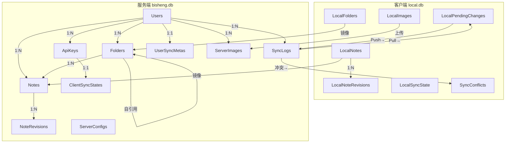
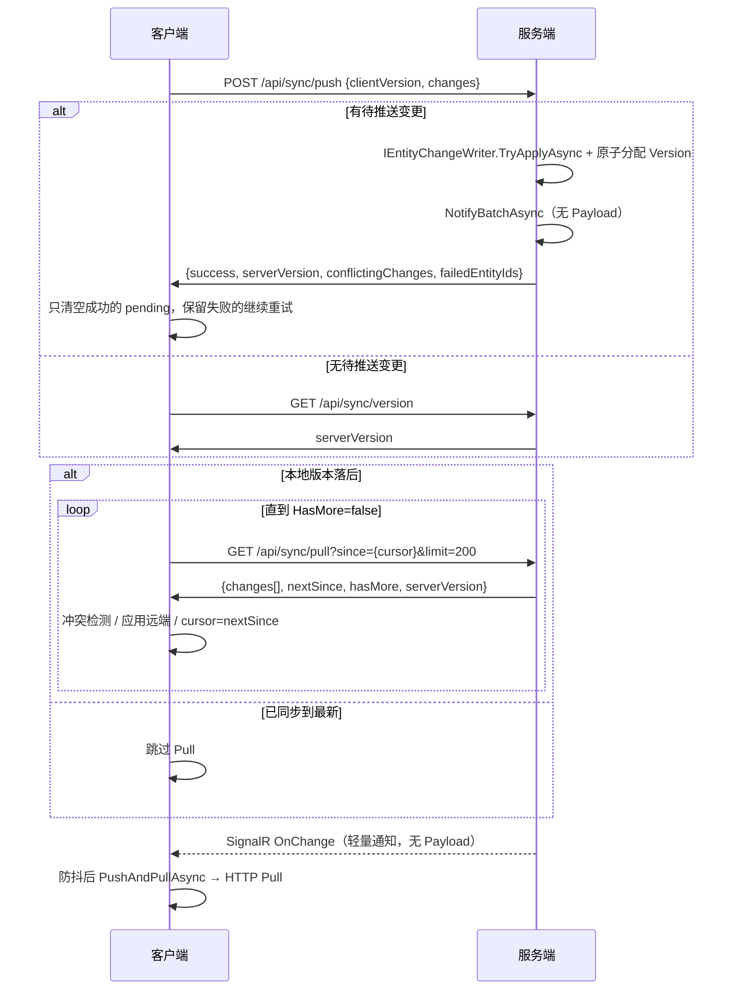

# 数据库设计文档

## 概述

BiSheng 采用 **双 SQLite 数据库**架构：

- **客户端** `local.db` — 存储本地数据副本、同步状态、待推送变更和冲突记录
- **服务端** `bisheng.db` — 存储权威数据、用户认证、同步日志和图片元数据

两个数据库通过增量同步协议（Push / Pull / SignalR 轻量通知）保持数据一致性。

本地备份、全量重建抢救与完整性检查见 [数据安全策略设计文档](./数据安全策略设计文档.md)。

---

## 客户端数据库（local.db）

文件位置：`exe 同目录/local.db`，EF Core 上下文：`LocalDbContext`

### 并发保护机制

| 层级 | 策略 | 说明 |
|------|------|------|
| SQLite 引擎 | **WAL 模式** | `PRAGMA journal_mode=WAL`，读写不互斥，提高并发读性能 |
| SQLite 引擎 | **busy_timeout=5000** | 写冲突时等待 5 秒而非立即报错 |
| 应用层 | **全局 SemaphoreSlim** | `LocalDbContext._writeLock(1,1)` 静态锁，所有 DbContext 实例共享，写操作通过 `SaveChangesWithLock()` 串行化 |

初始化流程（`App.xaml.cs`）：

```csharp
using var db = new LocalDbContext();
db.Database.EnsureCreated();   // 创建所有表（含 LocalPendingChange）
db.InitializeWalMode();        // PRAGMA journal_mode=WAL + busy_timeout=5000
```

### 表结构

#### LocalFolders — 文件夹

| 列名 | 类型 | 约束 | 说明 |
|------|------|------|------|
| Id | TEXT (Guid) | PK | 文件夹唯一标识 |
| Name | TEXT | NOT NULL | 文件夹名称 |
| ParentId | TEXT (Guid?) | — | 父文件夹 ID（null 表示根文件夹） |
| IsDeleted | INTEGER | — | 软删除标记 |
| Version | INTEGER | — | 同步版本号（与服务端对齐） |
| CreatedAt | TEXT | — | 创建时间 (UTC) |
| UpdatedAt | TEXT | — | 更新时间 (UTC) |

索引：
- `IX_LocalFolders_IsDeleted` → `IsDeleted`
- `IX_LocalFolders_ParentId` → `ParentId`

#### LocalNotes — 笔记

| 列名 | 类型 | 约束 | 说明 |
|------|------|------|------|
| Id | TEXT (Guid) | PK | 笔记唯一标识 |
| Title | TEXT | NOT NULL | 笔记标题 |
| Content | TEXT | — | Markdown 正文 |
| FolderId | TEXT (Guid) | NOT NULL | 所属文件夹 ID |
| IsDeleted | INTEGER | — | 软删除标记 |
| Version | INTEGER | — | 同步版本号 |
| CreatedAt | TEXT | — | 创建时间 (UTC) |
| UpdatedAt | TEXT | — | 更新时间 (UTC) |

索引：
- `IX_LocalNotes_FolderId_IsDeleted` → `(FolderId, IsDeleted)` 复合索引
- `IX_LocalNotes_UpdatedAt` → `UpdatedAt`

#### LocalNoteRevisions — 笔记历史版本（本地）

| 列名 | 类型 | 约束 | 说明 |
|------|------|------|------|
| Id | TEXT (Guid) | PK | 本地版本 ID |
| NoteId | TEXT (Guid) | — | 所属笔记 |
| RevisionNumber | INTEGER | — | 该笔记内递增序号 |
| Title | TEXT | MaxLength=256 | 快照标题 |
| Content | TEXT | — | 快照正文 |
| ContentHash | TEXT | MaxLength=64 | 内容指纹（去重） |
| CreatedAt | TEXT | — | 快照时间 (UTC) |
| SyncedToServer | INTEGER | — | 是否已对应云端（可选） |
| ServerRevisionId | TEXT (Guid?) | — | 云端 revision Id（可选） |

索引：
- `IX_LocalNoteRevisions_NoteId_RevisionNumber` → `(NoteId, RevisionNumber)`
- `IX_LocalNoteRevisions_NoteId_CreatedAt` → `(NoteId, CreatedAt)`

**设计要点**：离线编辑时写入；不经过 `LocalPendingChanges`。详见 [笔记历史版本设计文档](笔记历史版本设计文档.md)。

#### LocalImages — 图片元数据

| 列名 | 类型 | 约束 | 说明 |
|------|------|------|------|
| Id | TEXT (Guid) | PK | 图片唯一标识 |
| NoteId | TEXT (Guid) | — | 所属笔记 ID |
| FileName | TEXT | — | 原始文件名 |
| FilePath | TEXT | — | 本地路径（如 `images/{uuid}.png`） |
| FileSize | INTEGER | — | 文件大小（字节） |
| ContentType | TEXT | — | MIME 类型（默认 `image/png`） |
| Synced | INTEGER | — | 是否已上传到服务端 |
| RetryCount | INTEGER | — | 上传失败重试次数 |
| CreatedAt | TEXT | — | 创建时间 (UTC) |

索引：
- `IX_LocalImages_NoteId` → `NoteId`
- `IX_LocalImages_Synced` → `Synced`

#### LocalPendingChanges — 待推送变更队列

| 列名 | 类型 | 约束 | 说明 |
|------|------|------|------|
| Id | INTEGER | PK (AUTOINCREMENT) | 自增主键 |
| EntityType | TEXT | NOT NULL, MaxLength=32 | 实体类型：`"Folder"` 或 `"Note"` |
| EntityId | TEXT (Guid) | NOT NULL | 实体唯一标识 |
| Action | TEXT | NOT NULL, MaxLength=16 | 操作类型：`"Create"` / `"Update"` / `"Delete"` |
| Payload | TEXT | — | 变更内容的 JSON 序列化 |
| UpdatedAt | TEXT | NOT NULL | 本地操作时间戳（用于冲突解决） |

索引：
- `IX_LocalPendingChanges_EntityType_EntityId` → `(EntityType, EntityId)` **唯一索引**

**设计要点**：

- **去重合并**：唯一索引保证同一实体只保留一条记录，`LocalChangeTracker.RecordChange()` 对同实体的多次变更自动合并（Delete 优先级最高，Create 不降级为 Update）
- **替代旧设计**：原 `LocalSyncState.PendingChanges` JSON 单行存储已移除，独立表避免了每次推送时的全量 JSON 序列化/反序列化瓶颈
- **高频写入友好**：编辑笔记时只写入/更新单行，无需读写整个队列

#### LocalSyncState — 同步状态（单行）

| 列名 | 类型 | 约束 | 说明 |
|------|------|------|------|
| Id | INTEGER | PK, 默认值=1 | 固定单行（Id 始终为 1） |
| LastSyncVersion | INTEGER | — | 最后成功同步的服务端版本号 |
| LastImagePullTime | TEXT | — | 最后一次图片增量拉取时间 |

#### SyncConflicts — 冲突记录

| 列名 | 类型 | 约束 | 说明 |
|------|------|------|------|
| Id | INTEGER | PK (AUTOINCREMENT) | 自增主键 |
| EntityType | TEXT | NOT NULL, MaxLength=32 | 冲突实体类型 |
| EntityId | TEXT (Guid) | — | 冲突实体唯一标识 |
| EntityTitle | TEXT | — | 实体名称（便于 UI 展示） |
| LocalContent | TEXT | — | 本地版本内容 |
| RemoteContent | TEXT | — | 远端版本内容 |
| LocalUpdatedAt | TEXT | — | 本地变更时间 |
| RemoteUpdatedAt | TEXT | — | 远端变更时间 |
| IsResolved | INTEGER | — | 是否已解决 |
| CreatedAt | TEXT | — | 冲突检测时间 (UTC) |

---

## 服务端数据库（bisheng.db）

EF Core 上下文：`AppDbContext`，通过 DI 注入 `DbContextOptions<AppDbContext>`

### 表结构

#### Users — 用户

| 列名 | 类型 | 约束 | 说明 |
|------|------|------|------|
| Id | TEXT (Guid) | PK | 用户唯一标识 |
| Username | TEXT | NOT NULL, MaxLength=64, **Unique** | 用户名 |
| PasswordHash | TEXT | NOT NULL | 密码哈希 |
| CreatedAt | TEXT | — | 创建时间 (UTC) |

导航属性：`Folders` (1:N)、`Notes` (1:N)

#### ApiKeys — API 密钥

| 列名 | 类型 | 约束 | 说明 |
|------|------|------|------|
| Id | TEXT (Guid) | PK | 密钥唯一标识 |
| KeyValue | TEXT | NOT NULL, MaxLength=128, **Unique** | 64 字符随机 Hex 密钥 |
| DeviceName | TEXT | MaxLength=128 | 设备名称 |
| UserId | TEXT (Guid) | NOT NULL, FK→Users | 所属用户 |
| IsActive | INTEGER | — | 是否激活 |
| CreatedAt | TEXT | — | 创建时间 (UTC) |

索引：
- `IX_ApiKeys_KeyValue` → `KeyValue` **唯一**
- `IX_ApiKeys_UserId` → `UserId`

外键：`UserId → Users.Id` (Cascade Delete)

#### ServerConfigs — 全局配置（单行）

| 列名 | 类型 | 约束 | 说明 |
|------|------|------|------|
| Id | INTEGER | PK, 默认值=1 | 固定单行 |
| IsSetup | INTEGER | — | 是否已完成初始化 |
| SetupAt | TEXT | — | 初始化时间 |
| ImageRetentionDays | INTEGER | — | 图片软删除保留天数（默认 30） |
| MaxImageSizeMb | INTEGER | — | 单张图片最大大小（默认 10MB） |

#### Folders — 文件夹（权威数据）

| 列名 | 类型 | 约束 | 说明 |
|------|------|------|------|
| Id | TEXT (Guid) | PK | 文件夹唯一标识 |
| Name | TEXT | NOT NULL, MaxLength=128 | 文件夹名称 |
| ParentId | TEXT (Guid?) | FK→Folders.Id | 父文件夹（Restrict Delete） |
| UserId | TEXT (Guid) | NOT NULL, FK→Users.Id | 所属用户（Cascade Delete） |
| IsDeleted | INTEGER | — | 软删除标记 |
| Version | INTEGER | — | 单调递增版本号（用于增量同步） |
| CreatedAt | TEXT | — | 创建时间 (UTC) |
| UpdatedAt | TEXT | — | 更新时间 (UTC) |

索引：
- `IX_Folders_UserId_Version` → `(UserId, Version)` 复合索引（Pull 查询核心）

导航属性：`Parent` (自引用 1:1)、`Children` (1:N)、`Notes` (1:N)、`User` (1:1)

#### Notes — 笔记（权威数据）

| 列名 | 类型 | 约束 | 说明 |
|------|------|------|------|
| Id | TEXT (Guid) | PK | 笔记唯一标识 |
| Title | TEXT | NOT NULL, MaxLength=256 | 笔记标题 |
| Content | TEXT | — | Markdown 正文 |
| FolderId | TEXT (Guid) | NOT NULL, FK→Folders.Id | 所属文件夹（Restrict Delete） |
| UserId | TEXT (Guid) | NOT NULL, FK→Users.Id | 所属用户（Cascade Delete） |
| IsDeleted | INTEGER | — | 软删除标记 |
| Version | INTEGER | — | 单调递增版本号 |
| CreatedAt | TEXT | — | 创建时间 (UTC) |
| UpdatedAt | TEXT | — | 更新时间 (UTC) |

索引：
- `IX_Notes_UserId_Version` → `(UserId, Version)` 复合索引
- `IX_Notes_FolderId_IsDeleted` → `(FolderId, IsDeleted)` 复合索引

导航属性：`Folder` (1:1)、`User` (1:1)

#### NoteRevisions — 笔记历史版本（服务端）

| 列名 | 类型 | 约束 | 说明 |
|------|------|------|------|
| Id | TEXT (Guid) | PK | 版本记录 ID |
| NoteId | TEXT (Guid) | FK→Notes.Id (Restrict) | 所属笔记 |
| UserId | TEXT (Guid) | NOT NULL, FK→Users.Id | 所属用户（Cascade Delete） |
| RevisionNumber | INTEGER | — | 该笔记内递增序号 |
| Title | TEXT | NOT NULL, MaxLength=256 | 快照标题 |
| Content | TEXT | — | 快照正文 |
| ContentHash | TEXT | NOT NULL, MaxLength=64 | 内容指纹（去重） |
| NoteVersion | INTEGER | — | 快照时 Notes.Version（调试用） |
| CreatedAt | TEXT | — | 快照时间 (UTC) |

索引：
- `IX_NoteRevisions_NoteId_RevisionNumber` → `(NoteId, RevisionNumber)` **唯一**
- `IX_NoteRevisions_UserId_NoteId_CreatedAt` → `(UserId, NoteId, CreatedAt)`

**设计要点**：Push / REST 更新成功后经 `NoteRevisionSampling` 采样写入（有意义改动 + 最短间隔）；恢复历史可强制写入；笔记软删不级联删除历史；每笔记最多 100 条 FIFO。详见 [笔记历史版本设计文档](笔记历史版本设计文档.md)。

#### SyncLogs — 同步日志

| 列名 | 类型 | 约束 | 说明 |
|------|------|------|------|
| Id | INTEGER | PK (AUTOINCREMENT) | 自增主键 |
| EntityType | TEXT | NOT NULL, MaxLength=32 | 实体类型 |
| EntityId | TEXT (Guid) | NOT NULL | 实体唯一标识 |
| Action | TEXT | NOT NULL, MaxLength=16 | 操作类型 |
| Version | INTEGER | — | 全局单调递增版本号 |
| UserId | TEXT (Guid) | NOT NULL, FK→Users.Id | 所属用户（Cascade Delete） |
| Timestamp | TEXT | — | 变更时间 (UTC) |
| Payload | TEXT | — | 变更时的实体快照 (JSON) |

索引：
- `IX_SyncLogs_UserId_Version` → `(UserId, Version)` **唯一**（防止并发 Push 产生相同版本号）

**设计要点**：Version 在同一用户下唯一；分配由 `UserSyncMeta.CurrentVersion` 原子递增（`UserSyncVersionService`），不再依赖 `MAX(Version)+1`。Push 使用事务 + 同批 `ClientSyncState` 一并提交。

#### ClientSyncStates — 设备同步游标

| 列名 | 类型 | 约束 | 说明 |
|------|------|------|------|
| ApiKeyId | TEXT (Guid) | PK, FK→ApiKeys.Id | 设备（API Key）标识 |
| UserId | TEXT (Guid) | NOT NULL | 所属用户 |
| LastSyncVersion | INTEGER | — | 该设备最后确认的 ServerVersion |
| LastSeenAt | TEXT | — | 最后一次 Push/Pull/version 请求时间 |
| IsStaleExcluded | INTEGER | — | 长期离线时是否不参与裁剪基线 |

**设计要点**：Push/Pull/version 成功后由 `ClientSyncStateService` 更新。详见 [SyncLog裁剪设计文档](SyncLog裁剪设计文档.md)。

#### UserSyncMetas — 用户同步元数据

| 列名 | 类型 | 约束 | 说明 |
|------|------|------|------|
| UserId | TEXT (Guid) | PK, FK→Users.Id | 用户 ID |
| LogRetentionFloor | INTEGER | — | SyncLog 裁剪上界（Version < Floor 已删除） |
| CurrentVersion | INTEGER | — | 版本计数器：已分配的最高 SyncLog 版本号 |

**设计要点**：`CurrentVersion` 为 `GET /api/sync/version` 的权威读源；裁剪不重置计数器。详见 [版本管理与增量同步设计文档](版本管理与增量同步设计文档.md)。

#### ServerImages — 图片元数据

| 列名 | 类型 | 约束 | 说明 |
|------|------|------|------|
| Id | TEXT (Guid) | PK | 图片唯一标识 |
| UserId | TEXT (Guid) | NOT NULL, FK→Users.Id | 所属用户（Cascade Delete） |
| FileName | TEXT | NOT NULL, MaxLength=256 | 原始文件名 |
| ContentType | TEXT | NOT NULL, MaxLength=64 | MIME 类型 |
| FileSize | INTEGER | — | 文件大小（字节） |
| Extension | TEXT | MaxLength=16 | 扩展名（如 `.png`） |
| IsDeleted | INTEGER | — | 软删除标记 |
| DeletedAt | TEXT | — | 标记删除时间（用于延迟 GC） |
| CreatedAt | TEXT | — | 创建时间 (UTC) |

索引：
- `IX_ServerImages_UserId_IsDeleted` → `(UserId, IsDeleted)` 复合索引
- `IX_ServerImages_DeletedAt` → `DeletedAt`（GC 服务查询核心）

文件存储：磁盘 `uploads/{UserId}/{Id}.{ext}`

---

## 数据关系图



---

## 同步协议

### 同步接口

| 接口 | 方法 | 说明 |
|------|------|------|
| `/api/sync/version` | GET | 轻量级版本查询，返回当前 ServerVersion |
| `/api/sync/pull?since={version}&limit={L}` | GET | 分页拉取 since 之后的变更（`NextSince` / `HasMore`） |
| `/api/sync/push` | POST | 推送本地变更到服务端 |
| `/hubs/sync` → `OnChange` | SignalR | 轻量变更通知（无 Payload）；客户端防抖后 HTTP Pull |

### 增量同步流程



### 版本号感知

客户端通过三个阶段感知自身是否落后于服务端：

1. **Push 阶段**（有待推送时）：Push 响应包含 `serverVersion`，客户端直接获取
2. **版本检查**（无待推送时）：调用轻量级 `GET /api/sync/version` 获取 `serverVersion`
3. **对比判断**：`localVersion >= serverVersion` → 跳过 Pull；否则执行 Pull 补齐差距

这样确保客户端**始终知道自己是否落后**，即使 Pull 网络失败也能在下次同步时感知差距。

### 版本号机制

- 服务端 `UserSyncMeta.CurrentVersion`：每用户版本计数器，由 `UserSyncVersionService` 原子递增
- 服务端 `SyncLog.Version`：每条变更的版本号，同一用户下唯一（唯一索引）
- 客户端 `LocalSyncState.LastSyncVersion`：记录最后成功同步的版本号
- Pull 请求携带 `since=LastSyncVersion` 与 `limit`，服务端返回一批变更；`HasMore=true` 时客户端用 `NextSince` 继续请求
- Push 请求携带 `clientVersion`，若落后于服务端，返回 `ConflictingChanges`

### Push 失败处理

| 场景 | 处理 |
|------|------|
| 事务成功（所有变更提交） | 清空所有成功的 pending |
| 部分变更失败（事务仍提交） | 只清空成功的 pending，失败的保留重试 |
| 事务回滚 | `serverVersion=0`，保留所有 pending，下次重试 |

服务端响应中的 `failedEntityIds` 列表告诉客户端哪些变更失败了，客户端据此只移除成功的 pending。

### 冲突解决策略

| 场景 | 处理 |
|------|------|
| Pull 时本地有同实体 PendingChange | 创建 `SyncConflict`，从 PendingChange 表移除该实体 |
| Push 返回 ConflictingChanges | 同上，逐条检测本地是否有同实体 PendingChange |
| Pull 路径（含 SignalR 通知触发的 Pull）+ 本地有 Pending | 同上，记录冲突而非直接覆盖 |

解决方式（用户手动选择）：
- **保留本地** → 本地内容不变，将本地版本加入 PendingChange 表重新推送
- **保留远端** → 远端内容写入本地 DB，冲突标记为已解决
- **手动合并** → 合合内容写入本地 DB，加入 PendingChange 表重新推送

---

## 关键设计决策

| 决策 | 选择 | 理由 |
|------|------|------|
| PendingChange 存储 | 独立表 + 唯一索引 | 避免 JSON 单行瓶颈，支持去重合并，高频编辑只写单行 |
| 同步版本号 | `UserSyncMeta.CurrentVersion` 原子递增 + 用户唯一 | 替代 MAX+1，消除并发竞态；SyncLog 仍保留审计 |
| 同步业务分层 | `ISyncService` + 瘦 Controller | 业务可测、HTTP 与逻辑解耦 |
| Push 事务 | BeginTransaction + Commit | 所有变更原子提交，失败时整体回滚 |
| Push 失败处理 | 只清空成功的 pending | `failedEntityIds` 精确标记，避免丢失未成功的变更 |
| 版本感知 | `/api/sync/version` 轻量接口 | Push 无待推送时也能感知版本差距，决定是否跳过 Pull |
| SQLite 并发 | WAL + busy_timeout + SemaphoreSlim | WAL 允许读写并发，应用层锁防止并发写入 |
| 冲突处理 | 保留副本 + 用户决策 | 不自动覆盖，避免数据丢失 |
| 软删除 | IsDeleted 标记 | 支持多设备同步延迟，防止误删 |
| 图片与笔记解耦 | ServerImage 不加 NoteId FK | Markdown 内容是唯一真相源，保持图片同步管道独立性 |
| 笔记历史版本 | 独立 `NoteRevisions` 表，不走 SyncLog | 同步用终态折叠 + 裁剪；用户历史需 per-note 快照与 FIFO 保留（见 [笔记历史版本设计文档](笔记历史版本设计文档.md)） |
| 数据安全 | 本地自动备份 + 全量重建 Pending 抢救 + integrity_check | 防未 Push 丢失与库损坏（见 [数据安全策略设计文档](数据安全策略设计文档.md)） |

### ServerImage 与 Notes 解耦设计

**问题**：是否应在 `ServerImages` 表增加 `NoteId` 外键，直接关联图片与笔记？

**结论**：不加，保持解耦。

**理由**：

| 维度 | 加 NoteId FK | 保持解耦（当前方案） |
|------|-------------|------------------|
| 查询方式 | `WHERE NoteId = x` | 正则解析 Markdown 提取图片 ID |
| 数据一致性 | DB 与 Markdown 可能不一致（双真相源） | Markdown 是唯一真相源 |
| 图片同步管道 | 需改造，破坏独立性 | 独立管道，无需感知笔记 |
| 图片上传时序 | 图片可能在笔记之前上传，NoteId 可空 | 无约束 |
| 客户端改动 | 大：需改造上传流程 | 无 |

核心原则：

1. **单一真相源**：图片是否属于某篇笔记，完全由 Markdown 内容决定。引入 FK 会创建第二个真相源，带来一致性风险
2. **管道独立性**：图片同步管道（上传/增量拉取/GC 清理）独立于笔记文本同步，这是有意的设计，加 FK 会破坏这种独立性
3. **查询场景低频**：管理面板查看笔记关联图片是低频操作，正则解析的性能开销可忽略
4. **孤立图片清理**：如需清理无引用的图片，可通过定期扫描所有笔记内容提取图片 ID 与 `ServerImages` 表做差集实现，无需 FK
