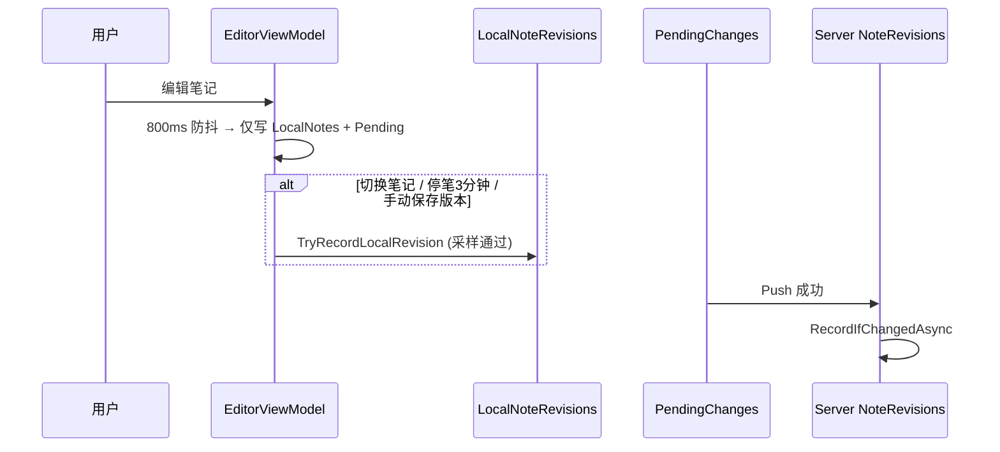
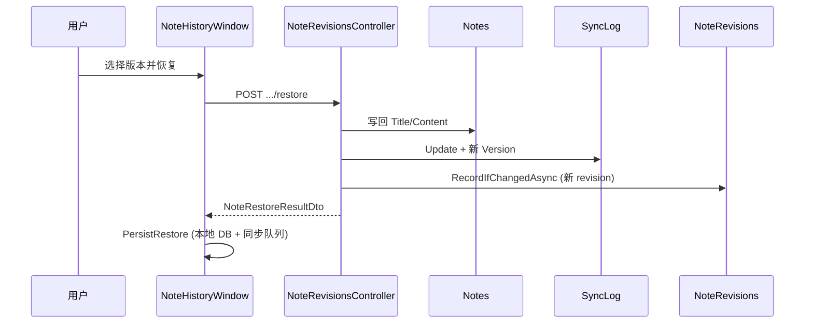

# 笔记历史版本设计文档

## 一、背景

用户需要查看**每篇笔记**的历史版本，最多保留 **100** 条。该需求与增量同步用的 `SyncLog` / 全局 `Version` **语义不同**，必须独立建模。

| 概念 | 用途 | 保留策略 |
|------|------|----------|
| **全局 `Version` + `SyncLog`** | 多设备增量同步、冲突检测 | 按 `min(LastSyncVersion)` 裁剪（见 [SyncLog裁剪设计文档](./SyncLog裁剪设计文档.md)） |
| **`NoteRevision` / `LocalNoteRevision`** | 用户可见的历史快照 | 每笔记 FIFO，最多 100 条，与 SyncLog 解耦 |

> **SyncLog 是快递追踪单，NoteRevision 是手稿存档。** 不能用 SyncLog 充当长期历史库——Pull 的终态折叠会丢弃中间态，裁剪会删除旧日志。

---

## 二、核心原则

### 2.1 每笔记独立版本链

```
Note A: rev 1 → rev 2 → … → rev 100（超出删最旧）
Note B: rev 1 → rev 3 → …（互不影响）
```

UI 展示 **「第 N 版 · 时间」**，不展示全局 `Version=3847`（该字段仅用于同步调试，存于 `NoteVersion` 可选字段）。

### 2.2 与同步协议正交

- **不**纳入 `EntityTypes` / `IEntityChangeWriter` 的 Folder 路径 / `LocalPendingChanges`（Note 变更经 Writer 时可选写 Revision）
- 参考图片管道：独立表 + 独立 API，不走笔记同步队列
- `LocalChangeTracker` 去重合并**不**作用于历史写入

### 2.3 已确认的产品规则

| 规则 | 行为 |
|------|------|
| **恢复** | 写回当前笔记正文，并**产生一条新的 revision**（恢复本身也算一次快照） |
| **删除笔记** | 笔记软删（`IsDeleted`），**历史保留** |
| **清理历史** | 用户手动删除单条或清空该笔记全部历史 |
| **服务端历史** | Push / REST 成功后经采样写入（与本地共用 `NoteRevisionSampling`）；**不阻断** Notes / SyncLog |
| **本地历史** | **不与 800ms 自动保存绑定**；见 §4.2 分层采样 |

### 2.4 本地 vs 服务端采样对比

| 维度 | 服务端 `NoteRevisions` | 本地 `LocalNoteRevisions` |
|------|------------------------|---------------------------|
| 触发 | Push 成功 / REST 更新（`RecordIfChangedAsync`） | 切换笔记、停笔空闲、退出、手动 |
| 判定实现 | `BiSheng.Shared/NoteRevisionSampling` | 同上 + `LocalRevisionSampler` / 档位收紧 |
| 微小改动 | hash 去重 + 字数/行数阈值 | 同左（手动/恢复仅 hash 去重） |
| 最短间隔 | `MinAutoIntervalMinutes`（默认 10 分钟） | 空闲/退出适用；**切换笔记**不受间隔约束 |
| 绕过采样 | REST「恢复历史」：`ForceNoteRevision`（仅 hash 去重） | 手动保存 / 本地恢复 |
| 对 Push 主路径 | **无影响**（仅少写 `NoteRevisions` 行） | — |

> **背景**：早期服务端仅「hash 变化即写」，配合客户端 ~2s 防抖 Push，云端历史会近乎秒级堆积。现已与本地空闲采样对齐门槛。

---

## 三、数据模型

### 3.1 服务端 `NoteRevisions`

| 字段 | 类型 | 说明 |
|------|------|------|
| Id | Guid PK | 版本记录 ID |
| NoteId | Guid FK→Notes | 所属笔记（**Restrict Delete**，软删笔记不级联删历史） |
| UserId | Guid FK→Users | 所属用户 |
| RevisionNumber | int | 该笔记内递增序号 1..N |
| Title | string | 快照标题 |
| Content | string | 快照正文 |
| ContentHash | string(64) | `SHA256(title + content)` 十六进制，用于去重 |
| NoteVersion | long | 快照时 `Notes.Version`（全局同步版本，调试用） |
| CreatedAt | DateTime | 快照时间 (UTC) |

索引：
- `(NoteId, RevisionNumber)` **唯一**
- `(UserId, NoteId, CreatedAt)`

### 3.2 客户端 `LocalNoteRevisions`

| 字段 | 类型 | 说明 |
|------|------|------|
| Id | Guid PK | 本地版本 ID |
| NoteId | Guid | 所属笔记 |
| RevisionNumber | int | 笔记内序号 |
| Title / Content / ContentHash | — | 同服务端 |
| CreatedAt | DateTime | 本地快照时间 |
| SyncedToServer | bool | 可选，是否已对应云端 |
| ServerRevisionId | Guid? | 可选，云端 revision Id |

索引：`(NoteId, RevisionNumber)`、`(NoteId, CreatedAt)`

### 3.3 共享常量与采样

- 上限：`BiSheng.Shared/NoteRevisionLimits.cs`（`MaxPerNote = 100`）
- 指纹：`BiSheng.Shared/NoteContentHash.cs`（`title\0content` 的 SHA-256 十六进制）
- 策略常量：`BiSheng.Shared/LocalRevisionPolicy.cs`（闲置分钟、最短间隔、字数/行数阈值）
- 判定：`BiSheng.Shared/NoteRevisionSampling.ShouldRecordAuto` / `IsSignificantChange`

---

## 四、写入时机

### 4.1 服务端

笔记 **Create / Update** 成功后，`EntityChangeWriter` 在写完实体与 `SyncLog` 之后调用 `NoteRevisionService.RecordIfChangedAsync`（`MutationWriteOptions.RecordNoteRevision` 默认开启）：

| 入口 | 说明 |
|------|------|
| `EntityChangeWriter`（Push 路径） | `SyncService.PushAsync` 事务内经 Writer 应用 Note Create/Update |
| `NoteMutationService`（REST 路径） | Create / Update；默认走自动采样 |
| `NoteRevisionsController` Restore | `ForceNoteRevision = true`：仅 hash 去重，不受间隔/微小改动限制 |

**自动采样通过条件**（`NoteRevisionSampling.ShouldRecordAuto`，默认阈值见 `LocalRevisionPolicy`）：

1. 相对上一版 `ContentHash` 不同  
2. 标题变化，或正文长度差 ≥ `MinCharDelta`，或行数差 ≥ `MinLineDelta`  
3. 距上一版 `CreatedAt` ≥ `MinAutoIntervalMinutes`（默认 10 分钟）

**不写入**：Folder 变更、Note Delete、Pull 应用、未通过采样、hash 未变。

**不影响**：Notes 正文是否更新、`SyncLog` / Version、SignalR 通知、其他端 Pull。

### 4.2 客户端（本地历史）

**原则**：`LocalNotes` 的 800ms 自动保存只负责持久化与同步队列；**历史快照使用更粗的分层触发**。

常量见 `BiSheng.Shared/LocalRevisionPolicy.cs`（保守档位可由 `EffectiveRevisionPolicy` 收紧）：

| 常量 | 默认 | 含义 |
|------|------|------|
| `IdleSnapshotMinutes` | 3 | 停笔空闲后尝试快照 |
| `MinAutoIntervalMinutes` | 10 | 空闲/退出类自动快照最短间隔 |
| `MinCharDelta` | 30 | 正文长度变化低于此视为微小改动 |
| `MinLineDelta` | 2 | 行数变化达到此视为有意义改动 |

| 触发 | 条件 | 说明 |
|------|------|------|
| **切换笔记** | 离开 A 前；hash 变化且「有意义改动」 | 自然会话边界；**不受**最短间隔约束 |
| **停笔空闲** | 连续 `IdleSnapshotMinutes` 无输入；`ShouldRecordAuto` | 长文编辑中段里程碑 |
| **退出应用** | 关闭窗口前；同空闲规则 | 防止只开一篇笔记时无检查点 |
| **手动** | 历史窗口「保存当前版本」 | 始终允许（仅 hash 去重） |
| **恢复** | `PersistRestore` | 始终允许 |
| ~~800ms 自动保存~~ | — | **不**写历史 |

「有意义改动」判定委托 `NoteRevisionSampling.IsSignificantChange`（经 `LocalRevisionSampler`）：

1. 标题变化 → 记录  
2. 正文长度差 ≥ `MinCharDelta` → 记录  
3. 行数差 ≥ `MinLineDelta` → 记录  
4. 否则（如改一个标点）→ **不记录**

本地历史**不**经过 `LocalChangeTracker`。

---

## 五、保留与裁剪

每篇笔记独立 FIFO：

```
插入第 101 条 → 删除该 NoteId 下 RevisionNumber 最小的记录
```

- **与 SyncLog 裁剪无关**：`SyncLogCompactionService` 不触碰 `NoteRevisions`
- **与笔记软删无关**：删笔记不删历史；用户通过 API / 历史窗口手动清理

---

## 六、API

路由前缀：`/api/notes/{noteId}/revisions`（`ApiKey` 认证）

| 方法 | 路径 | 说明 |
|------|------|------|
| GET | `/` | 列表（按 `RevisionNumber` 降序） |
| GET | `/{revisionId}` | 单条详情（含 Content） |
| POST | `/{revisionId}/restore` | 写回笔记 + SyncLog + 新 revision |
| DELETE | `/{revisionId}` | 删除单条历史 |
| DELETE | `/` | 清空该笔记全部历史 |

DTO：`BiSheng.Shared/Sync/NoteRevisionDtos.cs`（`NoteRevisionListItemDto`、`NoteRevisionDto`、`NoteRestoreResultDto`）。

恢复限制：笔记已软删时返回 400（历史仍可查看，不可恢复至当前笔记）。

---

## 七、客户端 UI

- 工具栏 **历史版本** 按钮 → `NoteHistoryWindow`
- **在线**：优先展示云端列表（`GET .../revisions`）
- **离线**：展示 `LocalNoteRevisions`
- 操作：预览、恢复、删除单条、清空全部

恢复成功后 `EditorViewModel.ContentRestored` 刷新编辑器，并通过 `LocalChangeTracker` 进入 Push 队列。

---

## 八、流程示意

### 8.1 正常编辑同步



### 8.2 恢复历史版本



---

## 九、为何不用 SyncLog 做历史

| 问题 | 说明 |
|------|------|
| 语义错误 | 全局 `Version` 混合文件夹/多笔记变更，不是「第 N 版」 |
| 终态折叠 | Pull 故意丢弃中间态 |
| 裁剪冲突 | 活跃设备同步后旧 SyncLog 会被 DELETE |
| 存储模型 | SyncLog 为 replication log 设计，非 per-entity retention |

---

## 十、相关代码

| 组件 | 路径 |
|------|------|
| 服务端实体 | `BiSheng.Server/Data/Entities/NoteRevision.cs` |
| 服务端服务 | `BiSheng.Server/Services/NoteRevisionService.cs` |
| API | `BiSheng.Server/Controllers/NoteRevisionsController.cs` |
| Push 挂钩 | `BiSheng.Server/Services/Mutations/EntityChangeWriter.cs`（经 Push 统一写路径） |
| REST 挂钩 | `BiSheng.Server/Controllers/NotesController.cs` |
| 客户端实体 | `BiSheng.Latte/Data/Entities/LocalNoteRevision.cs` |
| 客户端服务 | `BiSheng.Latte/Services/NoteRevisionService.cs` |
| 本地写入 | `BiSheng.Latte/ViewModels/EditorViewModel.cs` |
| 采样策略 | `BiSheng.Shared/NoteRevisionSampling.cs`, `LocalRevisionPolicy.cs`；客户端 `LocalRevisionSampler.cs` / `EffectiveRevisionPolicy.cs` |
| UI | `BiSheng.Latte/Views/NoteHistoryWindow.*` |
| 共享 DTO / 常量 | `BiSheng.Shared/NoteRevisionLimits.cs`, `NoteContentHash.cs`, `Sync/NoteRevisionDtos.cs` |
| Writer 选项 | `MutationWriteOptions.RecordNoteRevision` / `ForceNoteRevision` |
| 单测 | `tests/BiSheng.Server.Tests/Mutations/NoteRevisionSamplingTests.cs`, `NoteRevisionServiceTests.cs` |
| 迁移 | `Migrations/*_AddNoteRevision` (Server), `*_AddLocalNoteRevision` (Latte) |

---

## 十一、相关文档

- [版本管理与增量同步设计文档](./版本管理与增量同步设计文档.md) — 全局 `Version` 与 SyncLog
- [SyncLog裁剪设计文档](./SyncLog裁剪设计文档.md) — 同步日志裁剪（与历史版本无关）
- [数据库设计文档](./数据库设计文档.md) — 表结构明细
